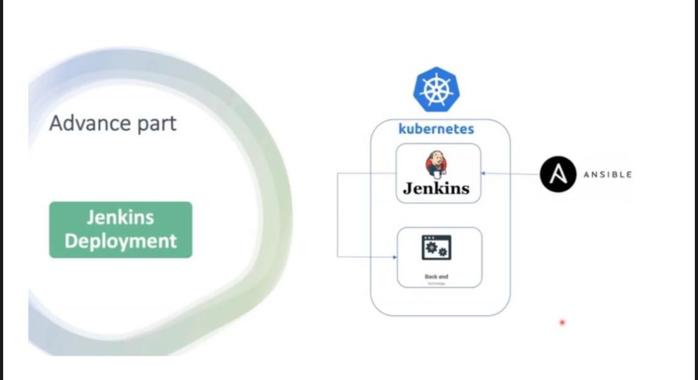
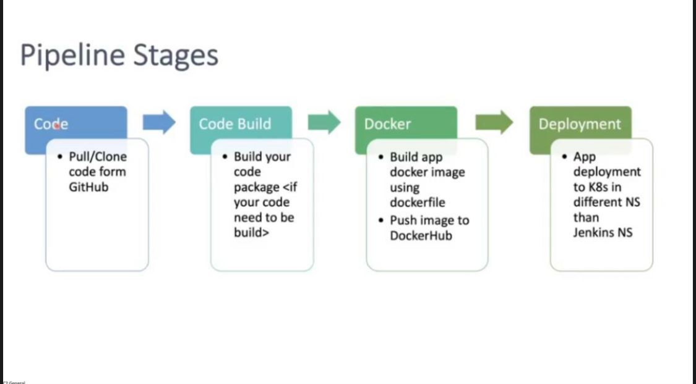
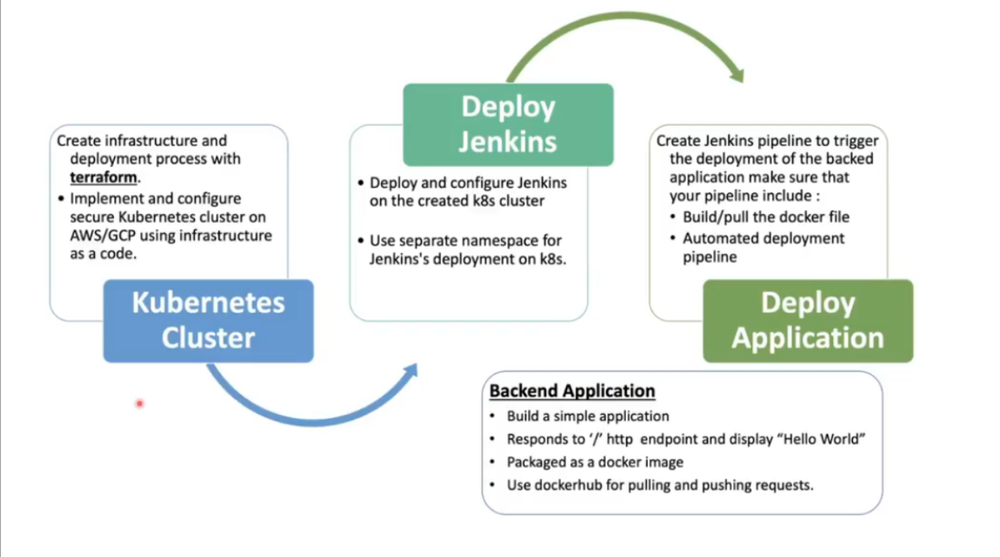

# DevOps-final-project-app-code
## Overview
Deploy a Python web application on GKE using CI/CD Jenkins Pipeline using the following steps and high-level diagram:

1. Implement a secure GKE Cluster
2. Deploy and configure Jenkins on GKE
3. Deploy the backend application on GKE using the Jenkins pipeline





### Used Tools
 - Terraform
 - Jenkins
 - Docker
 - Ansible
 - Kubernates
##### And all work is applied on GCP project: abdallah-iti, and region: us-central1

### This project devided int two parts:
 ##### - First: Infrastructure
 ##### - Second: App 

### First part of project: Infrastructure

#### Creating resources with terraform:
in terraform directory:
```bash
$ terraform init
$ terraform plan
$ terraform apply
```
#### SSH into VM:
```bash
$ gcloud compute ssh --zone "us-central1-b" "private-vm"  --tunnel-through-iap --project "abdallah-iti-377721"
```

#### Connect to cluster:
```bash
$ gcloud container clusters get-credentials private-standerd-gke-cluster --zone us-central1-b --project abdallah-iti-377721
```

#### Check pods and get load balancer external IP:
```bash
kubectl get all -n jenkins
```
#### Here we are in Jenkins


#### Print Jenkines password:
```bash
$ kubectl exec --namespace jenkins -it svc/jenkins-service -c jenkins -- /bin/cat /var/jenkins_home/secrets/initialAdminPassword && echo
```
#### Now we are ready to use Jenkins

### Then check: <a href="https://github.com/Abdalla1297/DevOps-Final-project-code" target="_blank">CI/CD in Jenkins</a>